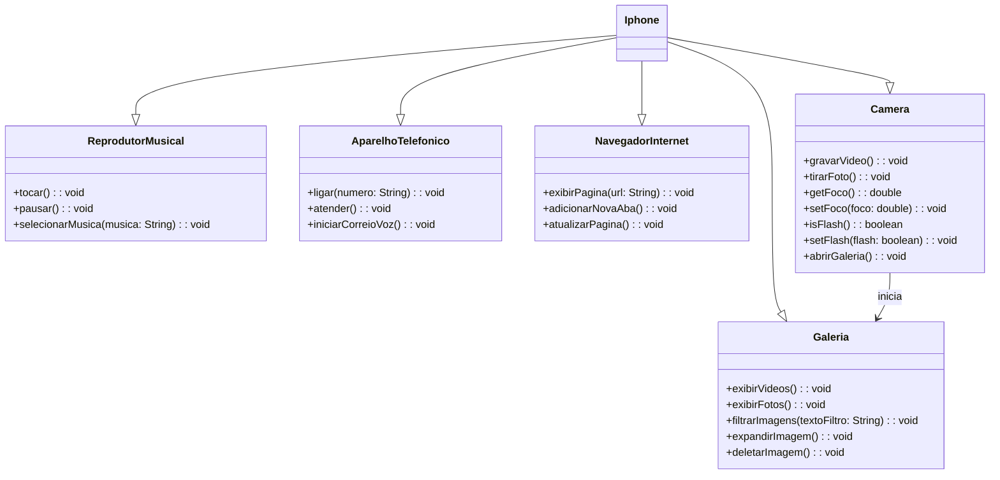

# Modelagem e Diagramação de um Componente iPhone

## Descrição do Projeto
Neste projeto, foi realizada a modelagem e diagramação UML do componente iPhone, abrangendo suas funcionalidades como Reprodutor Musical, Aparelho Telefônico, Navegador na Internet, Camera e Galeria. A modelagem foi baseada no vídeo de lançamento do iPhone de 2007, contemplando as funcionalidades principais apresentadas no evento.

## Contexto
Com base no vídeo de lançamento do iPhone de 2007 ([link do vídeo](https://www.youtube.com/watch?v=9ou608QQRq8)), foi elaborada a diagramação das classes e interfaces utilizando a ferramenta UML Mermaid. Em seguida, as classes e interfaces foram implementadas no formato de arquivos `.java`.

## Estrutura do Projeto
- **Implementação em Java**: Arquivos `.java` contendo a implementação das classes e interfaces modeladas.

## Ferramentas Utilizadas
- **Mermaid**: Utilizada para criar o diagrama UML abaixo.
- **Java**: Linguagem de programação utilizada para implementar as classes e interfaces.

##

